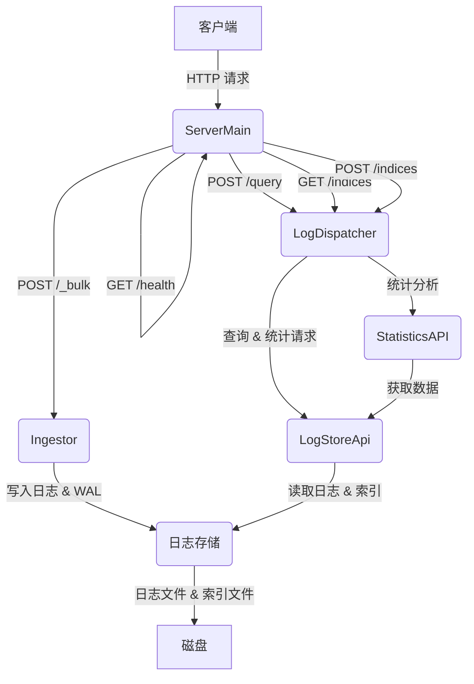

# LogGrep Server: 高性能日志存储、查询与分析平台

LogGrep Server 是一个基于 LogGrep 核心技术构建的高性能日志处理平台。它将原始的命令行工具扩展为一个功能强大的服务器，提供日志的摄取、存储、实时查询和深度分析能力。本服务器旨在利用静态和运行时模式，实现快速、经济高效的云日志存储。

## 核心特性

*   **高性能日志摄取**:
    *   通过 HTTP `POST /_bulk` 端点接收日志数据，支持流式传输。
    *   内置 ZSTD 压缩支持，显著减少网络传输和存储空间。
    *   采用 `RollingWriter` 机制，实现日志文件的滚动管理，优化存储效率。
    *   集成 WAL (Write-Ahead Log) 机制，确保数据持久性和可靠性，并支持可选的启动时恢复。
*   **强大的日志查询**:
    *   提供 HTTP `POST /query` 端点，支持 SPL (Search Processing Language) 语法，实现灵活的日志搜索和过滤。
        *   提供针对参数变量的数值型和文本型变量统计功能，包括平均值、总和、最大值、最小值、计数、中位数、标准差、百分位数。
        *   支持文本型数据的唯一值计数 (基于 HyperLogLog 算法)、频率分布和 Top-K 值分析。
        *   强大的分组聚合 (`GROUP BY`) 功能，允许用户按指定字段进行分组后执行统计计算。
        *   提供 `timechart` 功能，支持按时间跨度或时间段对日志事件进行计数和分组统计，便于趋势分析。
    *   利用位图索引、布隆过滤器和模式哈希等先进技术，实现毫秒级的查询响应。
    *   支持通配符搜索、KMP 模式匹配以及复杂的布尔逻辑 (`AND`, `OR`, `NOT`)。
    *   提供 `/indices` 端点用于管理日志索引，包括创建、删除和查看现有索引。
*   **HTTP API 接口**:
    *   提供 RESTful 风格的 API 接口，便于与其他系统和工具集成。
    *   所有查询和统计结果均以 JSON 格式返回，支持 `pretty` 参数格式化输出。
    *   包含 `/health` 端点用于健康检查。
*   **高并发与可配置性**:
    *   服务器设计支持多线程处理客户端请求，提高吞吐量。
    *   部分行为可通过环境变量进行配置，例如 WAL 恢复策略 (`LOGGREP_RECOVER_AT_START`) 和工作线程数 (`LOGGREP_WORKERS`)。

## 架构概览

LogGrep Server 采用模块化设计，主要组件包括：

1.  **Ingestor (摄取器)**: 负责接收、压缩和写入日志数据。通过 `RollingWriter` 管理日志文件和 WAL。
2.  **LogStoreApi (日志存储 API)**: 底层数据访问接口，处理日志的读取、解压缩、索引管理和位图操作。
3.  **LogDispatcher (日志分发器)**: 协调查询请求，将 SPL 查询解析并分发到底层 `LogStoreApi` 执行，并处理聚合和时间序列分析。
4.  **StatisticsAPI (统计 API)**: 提供基于 `LogStoreApi` 的高级统计分析功能。
5.  **ServerMain (服务器主程序)**: 负责网络通信、HTTP 请求解析和路由，将请求分发给相应的处理模块。



## 编译与运行

### 环境要求

*   **操作系统**: 兼容 Linux 环境 (例如 Red Hat 4.8.5 with Linux kernel 3.10.0, Ubuntu 11.3.0 with Linux kernel 5.15.0)。
*   **编译器**: `gcc` 版本 4.8.5 20150623 或更高。
*   **其他依赖**:
    *   Python 3.6.8+ (用于辅助脚本，如 `quickTest.py`, `largeTest.py`, `var_alias_tool.py`)。
    *   `pip3 install --upgrade requests`
    *   `yum groupinstall 'Development Tools'` (或等效的包管理命令安装开发工具)。

### 编译运行

请参考 `./http_server_quicktest.txt` 中的主要步骤进行编译和测试运行。

### 主要环境变量

*   `LOGGREP_RECOVER_AT_START`: 设置为 `1` (或其他非零值) 以在服务器启动时执行 WAL 恢复。
*   `LOGGREP_MAX_PENDING`: 设置最大待处理请求数 (默认为 `4096`)。
*   `LOGGREP_WORKERS`: 设置处理请求的工作线程数 (默认为 CPU 核心数)。
*   `LOGGREP_ROLLING_SIZE_MB`: 单个日志段文件达到该大小时触发滚动，默认 64 (MB)。
*   `LOGGREP_ROLLING_LINES`: 单个日志段文件达到该条数时触发滚动，默认 5000000 (条)。
*   `LOGGREP_MAX_DISK_BYTES`: 索引目录总磁盘空间达到该大小时触发滚动，默认 0 (字节，表示无限制)。
*   `LOGGREP_MAX_SEGMENTS`: 同一索引下最多保留的日志段数量，默认 100。
*   `LOGGREP_FLUSH_BYTES`: 日志写入后按字节大小自动刷盘，默认 64m (字节)。
*   `LOGGREP_FLUSH_RECORDS`: 日志写入后按记录条数自动刷盘，默认 50000 (条)。
*   `LOGGREP_FLUSH_INTERVAL_MS`: 日志写入后自动刷盘间隔，默认 3000 (毫秒)。
*   `LOGGREP_WAL_FSYNC`: 是否启用 WAL 同步刷盘，默认 0 (关闭)。
*   `LOGGREP_MAX_BODY_BYTES`: 单次上传数据最大上限，默认 256 (MB)。

## API 文档

### 1. 健康检查

*   **端点**: `GET /health`
*   **描述**: 检查服务器是否正常运行。
*   **响应**:
    ```json
    {
        "status": "ok"
    }
    ```

### 2. 日志摄取

*   **端点**: `POST /_bulk`
*   **描述**: 批量摄取日志数据。支持 ZSTD 压缩和分块传输。
*   **请求参数 (URL Query 或 Request Body)**:
    *   `index` (string, **必需**): 日志所属的索引名称。
    *   `sync` (string, 可选): 如果存在且非空，表示在摄取后同步 WAL。
    *   `flush` (string, 可选): 如果存在且非空，表示在摄取后强制刷新 segment。
*   **请求头**:
    *   `Content-Encoding: zstd` (可选): 如果日志数据经过 ZSTD 压缩。
    *   `Transfer-Encoding: chunked` (可选): 如果使用分块传输。
*   **请求体**: 原始日志数据，每行一条日志。
*   **响应**:
    ```json
    {
        "ingested": 100,      // 成功摄取的日志行数
        "flushed": true,      // 是否已刷新到磁盘
        "segment": "seg_name",// 如果刷新，对应的日志段名称
        "synced": true        // 是否已同步 WAL
    }
    ```
*   **示例 (使用 `curl`)**:

    **未压缩日志摄取**:
    ```bash
    curl -X POST "http://localhost:8080/_bulk?index=my_logs" \
         -H "Content-Type: text/plain" \
         --data-binary $'log line 1\nlog line 2\nlog line 3'
    ```

    **ZSTD 压缩日志摄取**:
    ```bash
    echo -e "compressed log line 1\ncompressed log line 2" | zstd | \
    curl -X POST "http://localhost:8080/_bulk?index=my_logs" \
         -H "Content-Type: application/octet-stream" \
         -H "Content-Encoding: zstd" \
         --data-binary @-
    ```

### 3. 日志查询

*   **端点**: `POST /query`
*   **描述**: 执行日志查询和统计分析。
*   **请求参数 (URL Query 或 Request Body)**:
    *   `index` (string, **必需**): 要查询的索引名称。
    *   `q` (string, **必需**): SPL (Search Processing Language) 查询语句。
    *   `limit` (int, 可选): 返回的日志条数限制，默认为 `100`。
    *   `pretty` (string, 可选): 如果存在且非空，响应 JSON 将进行美化格式化。
*   **请求体**: 可以是 `application/x-www-form-urlencoded` 格式的键值对，或者直接在 URL Query 中提供参数。
*   **SPL 语法示例**:
    *   **基本搜索**: `q=error AND "connection refused"`
    *   **时间图表**: `q=timechart span=1h count() by host`
    *   **去重计数**: `q=stats distinct(user) by host`
    *   **Top-K**: `q=top 10 user`
    *   **字段别名查询**: `q=Host:LabSZ` (详见下文“字段别名系统”)
    *   **数值过滤**: `q=Port:>=1024` (详见下文“数值过滤”)
*   **响应**: JSON 格式的查询结果。具体结构取决于 SPL 查询语句。
*   **示例 (使用 `curl`)**:

    **基本查询**:
    ```bash
    curl -X POST "http://localhost:8080/query" \
         -H "Content-Type: application/x-www-form-urlencoded" \
         --data-urlencode "index=my_logs" \
         --data-urlencode "q=error AND \"failed to connect\"" \
         --data-urlencode "pretty=true"
    ```

    **时间图表查询**:
    ```bash
    curl -X POST "http://localhost:8080/query" \
         -H "Content-Type: application/x-www-form-urlencoded" \
         --data-urlencode "index=my_logs" \
         --data-urlencode "q=timechart span=1h count() by host" \
         --data-urlencode "pretty=true"
    ```

### 4. 索引管理

*   **端点**: `GET /indices`
*   **描述**: 获取当前服务器管理的所有索引及其对应的存储路径。
*   **响应**:
    ```json
    {
        "indices": {
            "main": "../lib_output_zip/Ssh",
            "ssh": "../lib_output_zip/Ssh",
            "my_logs": "/path/to/my_logs_data"
        },
        "pending": 0 // 待处理的摄取任务数量
    }
    ```

*   **端点**: `POST /indices`
*   **描述**: 添加或删除日志索引。
*   **请求参数 (URL Query 或 Request Body)**:
    *   `index` (string, **必需**): 索引名称。
    *   `path` (string, 可选): 索引对应的存储路径。如果提供，则添加或更新索引。
    *   `delete` (string, 可选): 如果存在且非空，则删除指定索引。
    *   索引级设置 (可选): 当提供以下任一参数时，服务器会在该索引目录生成 `ingest.conf` 并持久化，用于覆盖默认刷新策略：
        *   `flush_bytes` (string): 如 `64m`、`1g`
        *   `flush_records` (int): 触发刷新所需记录数，如 `50000`
        *   `flush_interval_ms` (int): 定时刷新间隔，毫秒
        *   `max_segments` (int): 每索引保留段的最大数量
        *   `max_disk_bytes` (string): 段占用磁盘的最大总量，如 `5g`
        *   `wal_fsync` (int): 是否对 WAL 执行 `fsync`，`1` 开启
*   **响应**:
    ```json
    {
        "ok": true
    }
    ```
*   **示例 (使用 `curl`)**:

    **添加/更新索引**:
    ```bash
    curl -X POST "http://localhost:8080/indices" \
         -H "Content-Type: application/x-www-form-urlencoded" \
         --data-urlencode "index=new_logs" \
         --data-urlencode "path=/var/loggrep/new_logs_data"
    ```

    **添加索引并设置刷新策略**:
    ```bash
    curl -X POST "http://localhost:8080/indices" \
         -H "Content-Type: application/x-www-form-urlencoded" \
         --data-urlencode "index=access" \
         --data-urlencode "path=./ingest_example/access" \
         --data-urlencode "flush_records=1" \
         --data-urlencode "flush_interval_ms=0" \
         --data-urlencode "wal_fsync=1"
    ```

    **删除索引**:
    ```bash
    curl -X POST "http://localhost:8080/indices" \
         -H "Content-Type: application/x-www-form-urlencoded" \
         --data-urlencode "index=old_logs" \
         --data-urlencode "delete=true"
    ```

## 字段别名系统 (SPL 扩展)

LogGrep Server 支持通过字段别名简化查询，并提供更灵活的匹配选项。

### 配置文件优先级

*   优先读取压缩文件同目录下的 `<文件名>.var_alias`。
*   若不存在，则回退到目录级 `var_alias.conf`。

### 别名格式

支持两种配置格式：

1.  **变量ID → 别名**:
    ```
    E<模板ID>_V<变量ID>.<类型>=<别名>
    ```
    **示例**: `E1_V1.VAR=src.ip` (表示模板1的变量1，类型为VAR，别名为 `src.ip`)

2.  **别名 → 多变量**:
    ```
    <别名>: E<模板ID>_V<变量ID>, E<模板ID>_V<变量ID>, ...
    ```
    **示例**: `Host: E7_V4, E6_V4, E30_V3` (表示 `Host` 别名映射到多个模板的变量)

### 查询语法

在 `/query` 端点的 `q` 参数中，可以使用 `别名:值` 语法。

```
<别名>:<值>[|<选项>]
```

*   **选项**:
    *   `strict`: 仅在别名映射的变量位执行过滤；不回落到主模板常量匹配与异常匹配。
    *   `ci`: 回落到主模板常量匹配时大小写不敏感 (case-insensitive)。

### 数值过滤 (仅对 VAR 类型变量位生效)

*   **支持操作符**: `==`, `!=`, `>`, `>=`, `<`, `<=`
*   **支持范围写法**: `a..b` (闭区间)，例如 `1024..65535`

**示例**:

*   `Port:22` (等价于 `Port:==22`)
*   `Port:>=1024` (数值大于等于)
*   `Port:1024..65535` (范围过滤)
*   `Port:22|strict` (仅变量位过滤，不回落常量)

### 常量匹配回退

*   当别名映射的变量位没有命中且未指定 `strict` 时，系统会回落到主模板常量匹配并物化输出。
*   指定 `ci` 时，常量匹配大小写不敏感。

### 示例

*   `q=Host:LabSZ`
*   `q=Host:LabSZ|ci`
*   `q=Port:22`
*   `q=Port:>=1024`
*   `q=Port:1024..65535|strict`

## 兼容性提示

*   某些数据集 (例如示例 Ssh) 中，`Host` 更像模板常量而非变量位；在此情况下 `|strict` 可能无命中，建议使用默认或 `|ci` 以获得常量匹配效果。

## 论文引用

LogGrep Server 的核心技术源自以下学术论文：

```
Junyu Wei, Guangyan Zhang, Junchao Chen, Yang Wang, Weimin Zheng, Tingtao Sun, Jiesheng Wu, Jiangwei Jiang. LogGrep: Fast and Cheap Cloud Log Storage by Exploiting both Static and Runtime Patterns. in Proceedings of the 18th European Conference on Computer Systems (EuroSys’23), Roma, Italy, May 2023.
```
